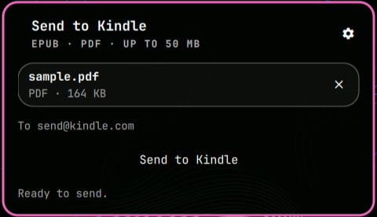

# Send to Kindle



Bar widget for Omarchy Quattro that sends EPUB/PDF files to a `@kindle.com`
address using Amazon's [Send to Kindle by email](https://www.amazon.com/sendtokindle)
over your own SMTP provider. No Calibre, no Docker, no daemons.

## Install

```sh
omarchy plugin add https://github.com/Simplici0/omarchy-send-to-kindle --enable
```

Update later with:

```sh
omarchy plugin update io.github.simplici0.send-to-kindle
```

Requires (all shipped with Omarchy): `python3` (stdlib only), the
`omarchy file select` chooser (XDG Desktop Portal) and `secret-tool`
(`libsecret` + `gnome-keyring-daemon`).

## Use

1. Click **Send to Kindle** in the bar (or
   `omarchy-shell shell summon io.github.simplici0.send-to-kindle '{}'`).
2. Click **Choose file** and pick an EPUB or PDF in the system file
   chooser — up to 50 MB (Amazon's per-email limit). Name, format
   and size are shown.
3. Open Settings (⚙): set the Kindle email, then **Show advanced** for
   sender, SMTP host/port and username. Fields save automatically as
   you type into the widget's inline `shell.json` entry.
4. Press **Send to Kindle**. States: ready → sending → sent / error.
   `Escape` closes the panel.

The picker is the system file chooser via `omarchy file select` (XDG
Desktop Portal), which runs out-of-process rather than as an in-shell
`FileDialog`: the panel closes before the dialog opens so the dialog
owns input. Cancelling the chooser changes nothing. The
`Convert to Kindle format` toggle sets the mail subject to `convert`
(Amazon converts EPUB to Kindle format).

## Configure

Non-secret settings (host, port, user, sender, destination) are edited in
the panel and stored in `shell.json`. Nothing secret is ever stored there,
in QML, or in `manifest.json`.

The SMTP secret (password / app-password) lives in gnome-keyring. Paste it
into **Settings → Secret (keyring)** and press **Save**: it reaches the
helper over stdin (never argv), the field is cleared right away, and
**Verify** confirms it is stored. The terminal equivalent, if you prefer:

```sh
secret-tool store --label 'Omarchy Send to Kindle' smtp your-smtp-user@your-smtp-host
```

The helper reads the secret back itself via `secret-tool lookup`; it is
never stored in `shell.json`, QML state, argv, or logs. If it is missing
the panel tells you to open Settings; if the mail server rejects it you
get an actionable SMTP error, never a stuck panel (5 min stall timeout
rearms to error).

TLS is mandatory: port 465 uses implicit TLS (`SMTP_SSL`); every other
port upgrades with STARTTLS, and the server certificate is always
verified. There is no way to disable TLS.

Gmail/Outlook note: plain passwords are usually rejected — create an
**app password** in your provider and store that. OAuth2 is out of scope
for this plugin.

Amazon requirements (on your Amazon account, not in this plugin):

- The **sender** address must be in your Amazon approved-senders list.
- The **destination** must end in `@kindle.com` (or `@free.kindle.com`).
- One file per send; EPUB/PDF only (MOBI/AZW are no longer accepted
  by Amazon email).

## Remove

```sh
omarchy plugin disable io.github.simplici0.send-to-kindle   # or: omarchy plugin remove io.github.simplici0.send-to-kindle --yes
secret-tool clear smtp your-smtp-user@your-smtp-host  # forget the stored secret
```

## Security

Unsandboxed by design, like all shell plugins: it runs inside
`omarchy-shell` with your user permissions and opens SMTP connections.
Only your chosen file leaves the machine, and only through your own
SMTP provider to Amazon. `Process.command` is always a fixed argv array
(no `bash -c` interpolation); audit before enabling, as with any plugin.

## Layout

- `manifest.json` — `bar-widget` contract only, no `panel` kind.
- `BarWidget.qml` — bar button + `Loader` hosting `Panel.qml`.
- `Panel.qml` — picker (system portal), metadata, config form, oneshot `Process` + timeout.
- `Model.js` — pure validation/formatting (testable with `node`).
- `helpers/send_kindle.py` — stdlib MIME + SMTP with verified TLS, secret via `secret-tool`.
